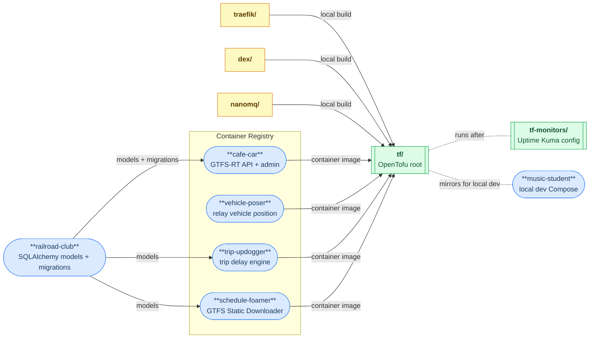
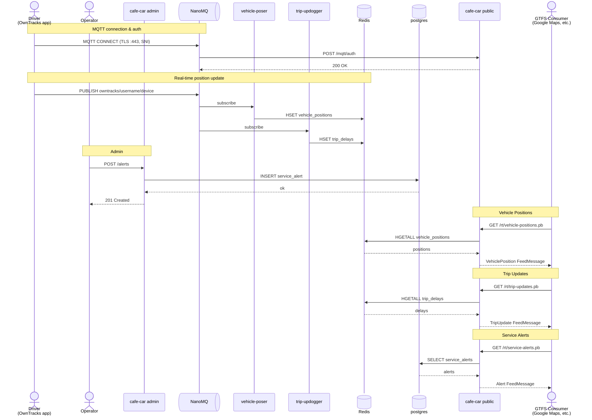
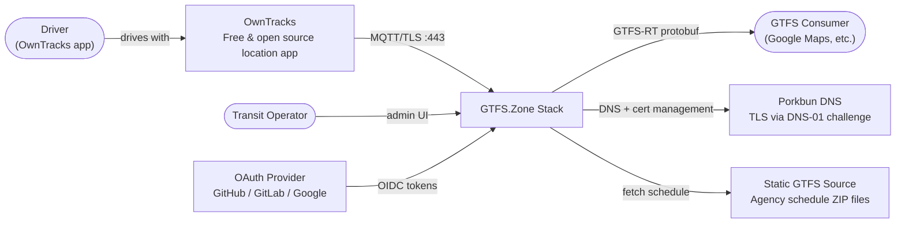
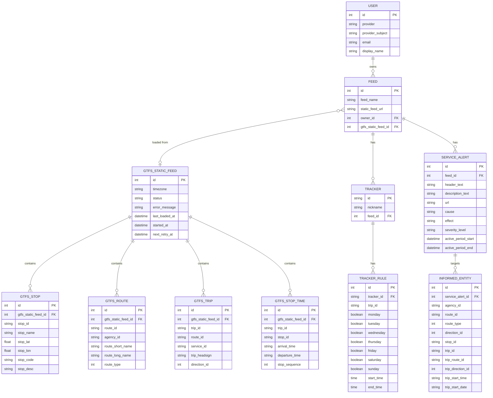
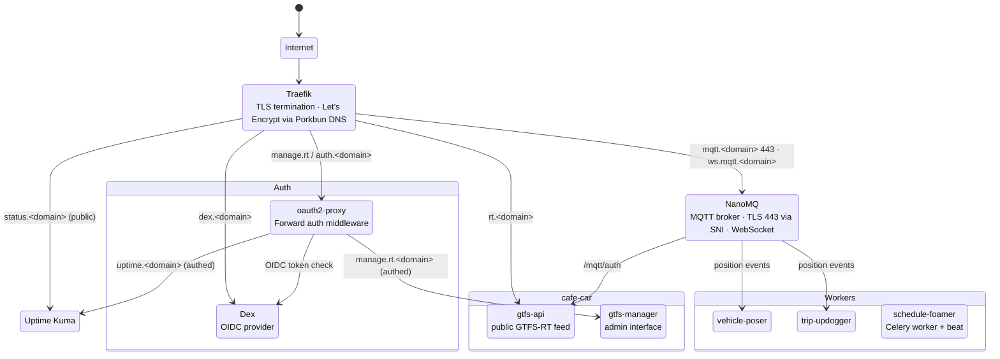
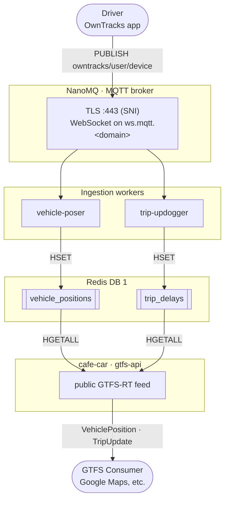
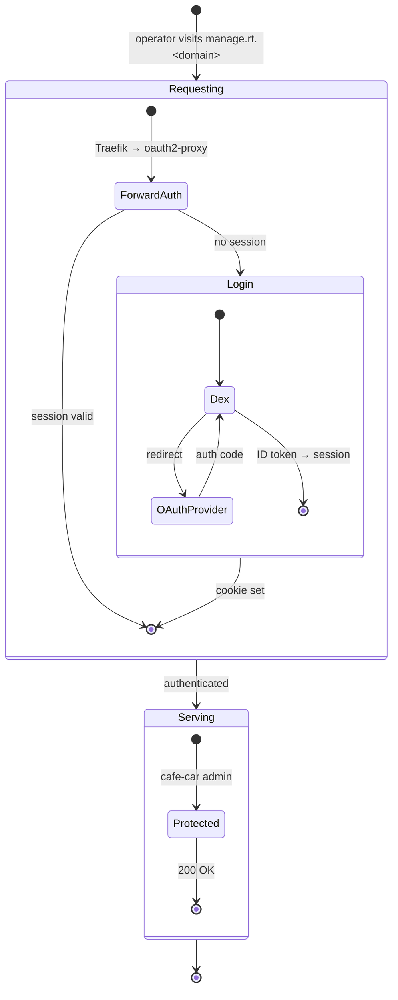

# deploy-gtfs-rt

**GTFS.Zone** is a "public option" for transit operators to publish real-time
GTFS feeds. The goal is to make it as simple, lightweight, and inexpensive as
possible — a small agency with minimal technical resources should be able to
get a live feed running in an afternoon.

Operators who don't want to self-host can use an already-running instance
without touching any of this. This repo is for those who want to run their own.

### How it fits together

The stack is built from these open-source projects:

| Project | Role |
|---------|------|
| [cafe-car](https://git.kcfam.us/gtfs.zone/cafe-car) | Core API — serves GTFS-RT feeds and handles admin |
| [vehicle-poser](https://git.kcfam.us/gtfs.zone/vehicle-poser) | Ingests vehicle positions from OwnTracks via MQTT → Redis |
| [trip-updogger](https://git.kcfam.us/gtfs.zone/trip-updogger) | Computes trip update delays from OwnTracks locations via MQTT → Redis |
| [schedule-foamer](https://git.kcfam.us/gtfs.zone/schedule-foamer) | Celery worker + beat scheduler for async static GTFS fetching |
| [railroad-club](https://git.kcfam.us/gtfs.zone/railroad-club) | Shared SQLAlchemy models and Alembic migrations |
| [music-student](https://git.kcfam.us/gtfs.zone/music-student) | Docker Compose stack for local development and testing |
| [landing-zone](https://git.kcfam.us/gtfs.zone/landing-zone) | Static homepage at gtfs.zone |

This repo provides the Terraform deployment that wires them together with supporting infrastructure.



**Issues & roadmap:** [issue tracker](https://git.kcfam.us/gtfs.zone/deploy-gtfs-rt/issues) · [project kanban](https://git.kcfam.us/gtfs.zone/-/projects/3)

---

## What you get

| URL | Service |
|-----|---------|
| `rt.<domain>` | Public GTFS-RT feed API |
| `manage.rt.<domain>` | Admin UI (auth-gated) |
| `auth.<domain>` | oauth2-proxy sign-in |
| `dex.<domain>` | Dex OIDC provider |
| `mqtt.<domain>:443` | MQTT (TLS, SNI-routed) |
| `ws.mqtt.<domain>` | MQTT over WebSocket |
| `uptime.<domain>` | Uptime Kuma dashboard (auth-gated) |
| `status.<domain>` | Public status page |


## System Diagrams

### Real-time data flow

A position update travels from a driver's phone to a GTFS-RT consumer in under a second.



### System context

External actors and systems the stack integrates with.



### Core data model

All models defined in [railroad-club](https://git.kcfam.us/gtfs.zone/railroad-club) and shared across services.



### Service routing

Subdomain routing from the internet through Traefik to each service, with data-layer connections.



### Real-time data pipeline

MQTT message from a driver's phone arriving as a GTFS-RT protobuf response.



### Auth flow

How an operator reaches a protected service via Dex and oauth2-proxy.




## Development

```bash
# Install git hooks (required once per clone)
pre-commit install
```

## Prerequisites

- **A server** running [Docker](https://docs.docker.com/engine/install/) with a public IP (any VPS works)
- **A domain on [Porkbun](https://porkbun.com/)** with API access enabled
- **[OpenTofu](https://opentofu.org/docs/intro/install/)** installed locally
- **At least one OAuth provider** (GitHub, GitLab, or Google) for user login
- **Credentials** for the private registry at `git.kcfam.us` (to pull `cafe-car`, `vehicle-poser`, and `trip-updogger` images)

## Step 1 — Domain and DNS API

1. Buy a domain at [porkbun.com](https://porkbun.com).
2. In your Porkbun account go to **API** → enable API access for the domain.
3. Generate an API key pair (`pk1_...` / `sk1_...`) — you'll need both.

## Step 2 — OAuth app

Create an OAuth app with at least one provider. Use `https://dex.<your-domain>/callback` as the authorization callback URL.

- **GitHub**: Settings → Developer settings → OAuth Apps → New OAuth App
- **GitLab**: User Settings → Applications
- **Google**: Google Cloud Console → APIs & Services → Credentials → OAuth 2.0 Client ID (Web application)

## Step 3 — Configure secrets

```bash
cd tf/
cp secrets.auto.tfvars.example secrets.auto.tfvars
```

Edit `secrets.auto.tfvars` and fill in at minimum:

```hcl
domain    = "yourdomain.com"
server_ip = "1.2.3.4"   # your server's public IP

# Porkbun DNS API
porkbun_api_key        = "pk1_..."
porkbun_secret_api_key = "sk1_..."

# At least one OAuth provider
github_oauth = {
  client_id     = "..."
  client_secret = "..."
}

# Private registry (for cafe-car, vehicle-poser, and trip-updogger images)
registry_username = "..."
registry_password = "..."
```

If your Docker host is remote, also set:

```hcl
docker_host = "ssh://myserver"
```

## Step 4 — Deploy

```bash
cd tf/
tofu init
tofu apply
```

Terraform will:
- Create DNS records on Porkbun
- Build local images for Traefik, Dex, and NanoMQ from this repo
- Pull `cafe-car`, `vehicle-poser`, and `trip-updogger` from the private registry
- Start all containers; Traefik obtains TLS certificates automatically via DNS challenge

Retrieve auto-generated passwords if needed:

```bash
tofu output -raw postgres_admin_password
tofu output -raw uptime_kuma_password
```

## Step 5 — Configure monitors

After the main stack is running, set up Uptime Kuma monitors:

```bash
cd tf-monitors/
cp secrets.auto.tfvars.example secrets.auto.tfvars
```

Fill in `tf-monitors/secrets.auto.tfvars`:

```hcl
domain               = "yourdomain.com"   # must match tf/
uptime_kuma_password = "..."              # from: tofu -chdir=../tf output -raw uptime_kuma_password
telegram_bot_token   = "..."             # optional, for alert notifications
telegram_chat_id     = "..."
```

```bash
tofu init
tofu apply
```

## Updating

To redeploy after an image update:

```bash
cd tf/
tofu apply -replace=docker_container.rt_api_public -replace=docker_container.rt_api_admin
```

To rebuild a locally-built image (Traefik/Dex/NanoMQ), edit any file in its
source directory — Terraform detects the change and rebuilds on the next
`apply`.

## Sharing a Docker host

Set `name_prefix = "gtfs"` in `secrets.auto.tfvars` to namespace all
containers, volumes, and networks. To reuse an existing Traefik instance:

```hcl
use_external_traefik     = true
external_traefik_network = "proxy-tier"
traefik_cert_resolver    = "letsencrypt"
```
