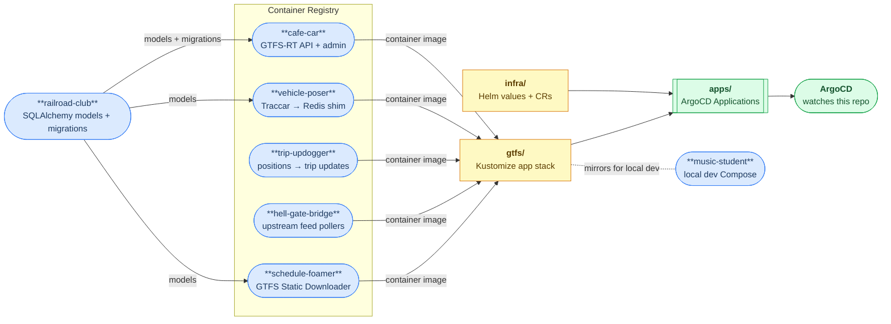
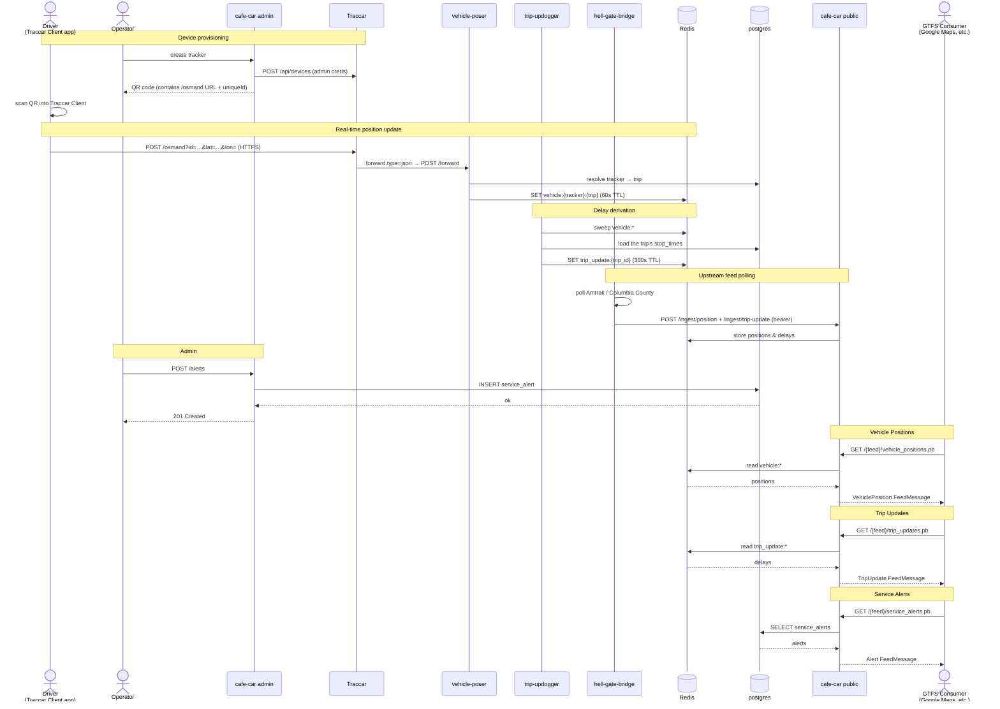
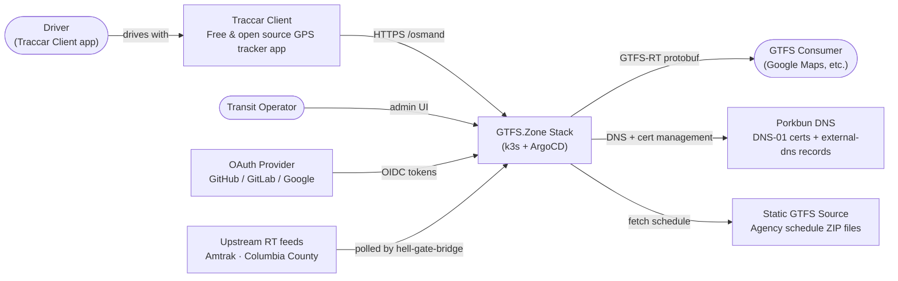
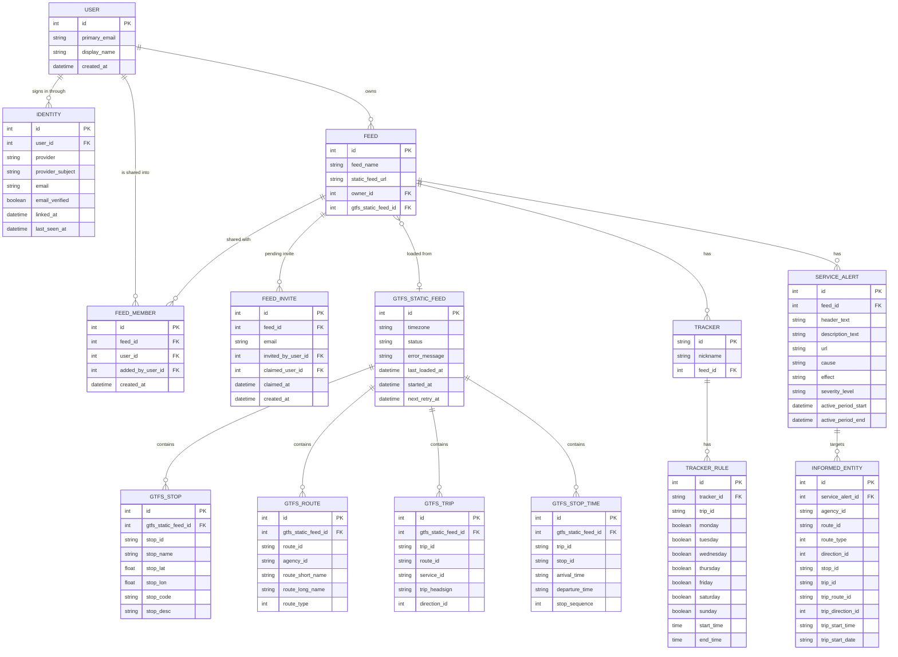
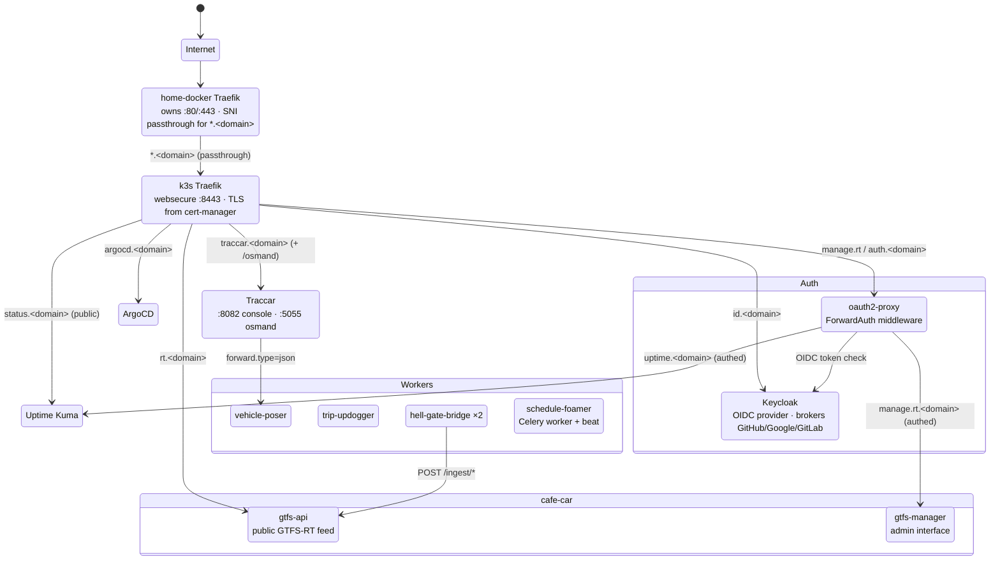
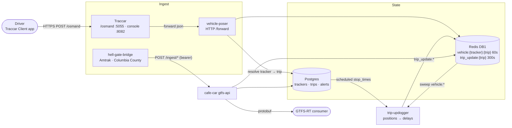
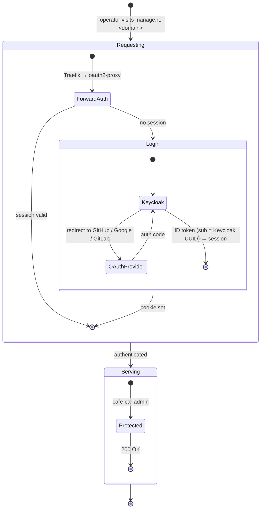

# deploy-gtfs-rt

**GTFS.Zone** is a "public option" for transit operators to publish real-time
GTFS feeds. The goal is to make it as simple, lightweight, and inexpensive as
possible: a small agency with minimal technical resources should be able to
get a live feed running in an afternoon.

Operators who don't want to self-host can use an already-running instance
without touching any of this. This repo is for those who want to run their own.

### How it fits together

The stack is built from these open-source projects:

| Project | Role |
|---------|------|
| [cafe-car](https://git.kcfam.us/gtfs.zone/cafe-car) | Core API, serves GTFS-RT feeds and handles admin |
| [vehicle-poser](https://git.kcfam.us/gtfs.zone/vehicle-poser) | Receives Traccar position forwards over HTTP → Redis |
| [trip-updogger](https://git.kcfam.us/gtfs.zone/trip-updogger) | Sweeps live positions against the schedule → trip updates in Redis |
| [hell-gate-bridge](https://git.kcfam.us/gtfs.zone/hell-gate-bridge) | Polls upstream feeds (Amtrak, Columbia County) → rt-api |
| [schedule-foamer](https://git.kcfam.us/gtfs.zone/schedule-foamer) | Celery worker + beat scheduler for async static GTFS fetching |
| [railroad-club](https://git.kcfam.us/gtfs.zone/railroad-club) | Shared SQLAlchemy models and Alembic migrations |
| [music-student](https://git.kcfam.us/gtfs.zone/music-student) | Docker Compose stack for local development and testing |
| [landing-zone](https://git.kcfam.us/gtfs.zone/landing-zone) | Static homepage at gtfs.zone |

This repo provides the Kubernetes (k3s + ArgoCD) deployment that wires them
together with supporting infrastructure.



**Issues & roadmap:** [issue tracker](https://git.kcfam.us/gtfs.zone/deploy-gtfs-rt/issues) · [project kanban](https://git.kcfam.us/gtfs.zone/-/projects/3)

---

## What you get

| URL | Service |
|-----|---------|
| `rt.<domain>` | Public GTFS-RT feed API |
| `manage.rt.<domain>` | Admin UI (auth-gated) |
| `auth.<domain>` | oauth2-proxy sign-in |
| `id.<domain>` | Keycloak OIDC provider (brokers GitHub/Google/GitLab) |
| `traccar.<domain>` | Traccar console; `/osmand` takes phone position reports |
| `uptime.<domain>` | Uptime Kuma dashboard (auth-gated) |
| `status.<domain>` | Public status page |
| `argocd.<domain>` | ArgoCD UI |


## System Diagrams

### Real-time data flow

A position update travels from a driver's phone to a GTFS-RT consumer in under a second.



### System context

External actors and systems the stack integrates with.



### Core data model

All models defined in [railroad-club](https://git.kcfam.us/gtfs.zone/railroad-club) and shared across services.



### Service routing

Hostname routing from the internet through to each service, with data-layer
connections. The edge is home-docker's Traefik, which passes `*.gtfs.zone`
through untouched by SNI; the cluster's own Traefik terminates TLS.



### Real-time data pipeline

A position from a driver's phone becoming a GTFS-RT protobuf response.



### Auth flow

How an operator reaches a protected service via Keycloak and oauth2-proxy.




## Development

```bash
# Install git hooks (required once per clone)
pre-commit install
```

There is **no imperative deploy step.** ArgoCD watches this repo and reconciles
the cluster to match it: you change YAML, commit, and push.

Before committing changes under `gtfs/`, render the tree the same way ArgoCD's
KSOPS plugin does:

```bash
PATH="$HOME/.local/bin:$PATH" SOPS_AGE_KEY_FILE=$PWD/age.key \
  kustomize build --enable-alpha-plugins --enable-exec gtfs
```

For changes under `infra/`, render the actual upstream chart with your values
rather than trusting the documented defaults:

```bash
helm template <release> <repo>/<chart> --version <v> -n <ns> -f infra/<comp>/values.yaml
```

### Cluster access

`kubectl` requires an SSH tunnel, since the kubeconfig points at `127.0.0.1:6443`.
Keep this running in a separate terminal:

```bash
ssh -N -L 6443:127.0.0.1:6443 kcfam
```

ArgoCD signs in through Keycloak ("Log in via Keycloak"), and authorizes on the
`argocd-admins` group; `argocd login argocd.gtfs.zone --sso` does the same for
the CLI. The local `admin` account stays enabled as break-glass, since Keycloak
depends on the database ArgoCD deploys:

```bash
kubectl -n argocd get secret argocd-initial-admin-secret -o jsonpath="{.data.password}" | base64 -d
```

### Updating ArgoCD itself

ArgoCD is deliberately not self-managed, so `infra/argocd/values.yaml` is not
reconciled by a sync. Apply it by hand, always with `--version`, or the change
silently becomes an ArgoCD upgrade as well:

```bash
helm upgrade argocd argo/argo-cd -n argocd --version 10.1.4 -f infra/argocd/values.yaml
```

### Database access

Set up port-forward in a separate terminal:

```bash
kubectl -n gtfs port-forward svc/postgres-rw 5432:5432
```

Access via SQL (psql):

```bash
PGPASSWORD="$(kubectl -n gtfs get secret postgres-rt-api -o jsonpath='{.data.password}' | base64 -d)" \
  psql -h localhost -U rt_api -d rt_api
```

## Prerequisites

- **A server** with a public IP running [k3s](https://k3s.io/) (installed with
  `--disable traefik`; this repo brings its own via Helm) and `open-iscsi`
  enabled for Longhorn.
- **A domain on [Porkbun](https://porkbun.com/)** with API access enabled,
  used by both cert-manager (DNS-01) and external-dns.
- **At least one OAuth provider** (GitHub, GitLab, or Google) for user login.
- Local tooling: `kubectl`, `helm`, `kustomize`, `sops`, `age`, `ksops`.

> **Host tuning:** k3s, Longhorn and containerd share root's inotify quota. The
> default `fs.inotify.max_user_instances=128` is not enough and fails in
> confusing ways (processes silently unable to create file watchers). Set it to
> 1024 in `/etc/sysctl.d/`.

## Step 1: Domain and DNS API

1. Buy a domain at [porkbun.com](https://porkbun.com).
2. In your Porkbun account go to **API** → enable API access for the domain.
3. Generate an API key pair (`pk1_...` / `sk1_...`); you'll need both.

DNS records are **not** written by hand: external-dns creates them from the
`external-dns.alpha.kubernetes.io/target` annotation on each `IngressRoute`.
The bare apex is left alone deliberately.

## Step 2: OAuth app

Create an OAuth app with at least one provider. Use
`https://id.<your-domain>/realms/gtfs/broker/github/endpoint` as the authorization
callback URL. (Dex is gone; a `https://dex.<your-domain>/callback` entry left over
from before the cutover can be deleted.)

- **GitHub**: Settings → Developer settings → OAuth Apps → New OAuth App
- **GitLab**: User Settings → Applications
- **Google**: Google Cloud Console → APIs & Services → Credentials → OAuth 2.0 Client ID (Web application)

## Step 3: Secrets (SOPS + age)

Secrets live in git, encrypted with [SOPS](https://github.com/getsops/sops) and
an [age](https://github.com/FiloSottile/age) key, and are decrypted inside the
cluster by a KSOPS plugin sidecar on the argocd-repo-server.

```bash
age-keygen -o age.key                      # keep this OUT of git (it is gitignored)
# put the public recipient in .sops.yaml, then edit secrets with:
sops infra/secrets/porkbun-secret.enc.yaml
sops gtfs/secrets/gtfs-app-secrets.enc.yaml
```

`sops set` updates a single value without printing plaintext. The age private
key must also exist in-cluster as the `sops-age` Secret in the `argocd`
namespace: that is the one piece of out-of-band bootstrap this design needs.

Populate at minimum:

- `infra/secrets/`: Porkbun API key/secret, once per consuming namespace
  (`cert-manager` uses `PORKBUN_API_KEY`/`PORKBUN_SECRET_API_KEY`,
  `external-dns` uses `API_KEY`/`API_SECRET`), plus `argocd-oidc.enc.yaml`
  (`clientSecret`), which argocd-server reads for Keycloak SSO. It must equal
  `KEYCLOAK_ARGOCD_CLIENT_SECRET` in `gtfs-app-secrets`, and must exist before
  ArgoCD starts with `oidc.config` set.
- `gtfs/secrets/gtfs-app-secrets.enc.yaml`: session key, oauth2-proxy cookie
  secret, the Keycloak↔oauth2-proxy, ↔Traccar, ↔cafe-car and ↔ArgoCD client
  secrets (`KEYCLOAK_*_CLIENT_SECRET`), the
  Keycloak bootstrap admin password, OAuth connector credentials,
  `INGEST_API_TOKEN`, and the `TRACCAR_ADMIN_*` pair.
- `gtfs/secrets/postgres-*.enc.yaml`: CNPG role passwords.

## Step 4: Bootstrap

Point the hostnames and the target IP at your own domain first: they are
referenced in `gtfs/ingressroutes.yaml`, `infra/argocd/manifests/ingress.yaml`,
`infra/cert-manager/manifests/`, `gtfs/keycloak/gtfs-realm.json` and
`gtfs/traccar/traccar.xml`.

```bash
# 1. install ArgoCD (once, out of band; it is deliberately NOT self-managed)
helm install argocd argo/argo-cd -n argocd --create-namespace --version 10.1.4 \
  -f infra/argocd/values.yaml

# 2. give it the age key so it can decrypt secrets
kubectl -n argocd create secret generic sops-age --from-file=keys.txt=age.key

# 3. hand it the repo; everything else follows from the app-of-apps
kubectl apply -f apps/root.yaml
```

Watch it converge with `kubectl get app -n argocd`. Sync waves bring things up in
order: storage/database operators → edge and DNS → issuers and secrets → the app.

On a cold bootstrap, ArgoCD's `oidc.config` references the `argocd-oidc` Secret
that step 3 is what creates, so the Keycloak login button does not work until
`infra-secrets` (wave 2) has synced. Use the local `admin` account until then;
the `argocd-admins` group membership also has to be assigned by hand, since
group membership is per-user and not part of the realm import.

## Step 5: First run

1. `curl https://rt.<domain>/health` should be 200 over a Let's Encrypt cert
   issued by cert-manager (not by whatever fronts your edge).
2. Sign in at `https://manage.rt.<domain>`; the first login creates the owner
   account that feeds are attached to.
3. Bootstrap Traccar: the first `POST /api/users` against an empty `tc_users`
   becomes administrator. **Use exactly the `TRACCAR_ADMIN_*` values from
   `gtfs-app-secrets`**: rt-api reuses them for device auto-provisioning, so a
   different password silently breaks the integration. Then enable registration
   (`PUT /api/server {"registration": true}`) so OIDC logins auto-provision.
4. Create feeds and their trackers, and make sure each poller's
   `INGEST_VEHICLE_ID` matches a real tracker id: a mismatch produces no
   positions and no error.
5. Uptime Kuma's public status page must be created in its UI before
   `status.<domain>` shows anything useful.

## Updating

Edit a manifest, commit, push. ArgoCD picks it up within a few minutes, or
immediately with:

```bash
kubectl annotate app <name> -n argocd argocd.argoproj.io/refresh=hard --overwrite
```

Image tags are pinned per workload. CI publishes `:latest` and `:<short-sha>`
only; **there is no `:main` tag**, so bumping a version is a manifest edit and
a commit, not a redeploy.
